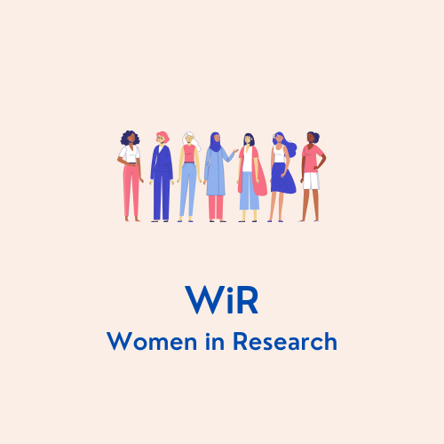

Women in Research (WiR) is an initiative started within the [Integrated Research Training group (MGK)](https://www.sfb1287.uni-potsdam.de/en/project-mgk/) of the [Collaborative Research Center 1287: Limits of Variability in Language: Cognitive, Computational, and Grammatical Aspects](https://www.sfb1287.uni-potsdam.de/en/overview/) at the University of Potsdam. This initiative aims to actively promote equal representation of women, men, and gender diverse individuals across the academic strata in our departments by raising awareness of gender inequality in academic contexts and by providing targeted support to female and gender diverse researchers. We offer both informative and skills-based workshops, as well as resources to improve gender equality in academic settings. While some activities we offer will be targeted more towards women, many will be of interest to all genders. Therefore, we encourage participation from everyone. In short, WiR aims to help all members in our group strengthen the skills needed to create a more inclusive academic community of the present and of the future.

---
#### Contact
WiR was co-founded by PhD candidate Sabia Costantini and Post-Doc researcher Pamela Fuhrmeister. If you have any questions or would like to get in touch, please contact Sabia Costantini (sabia dot costantini at uni hyphen potsdam dot de).

